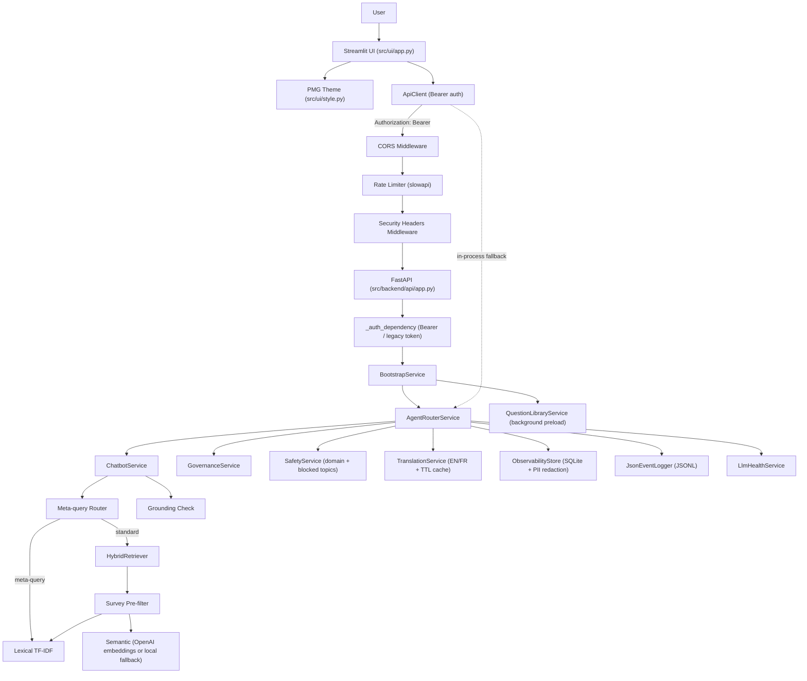
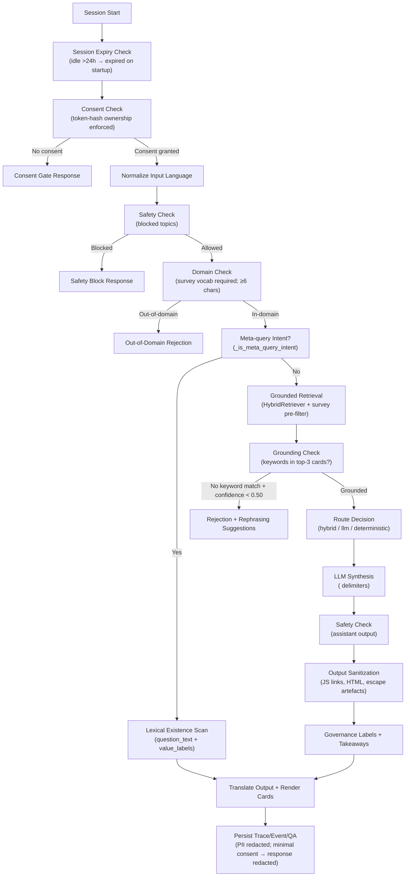

# PMG Intelligence Capstone Chatbot

Research-first conversational assistant for PMG data dictionaries with grounded retrieval, hybrid routing, security hardening, and operational observability/governance controls.

---

## Executive Snapshot

| Area | Current state |
|---|---|
| Journey scope | Session chat → domain check → safety check → meta/grounding router → grounded retrieval → routed response → citations/feedback → trace logging |
| Architecture | Streamlit UI + FastAPI service (CORS + rate limit + security headers) + in-process adapter fallback |
| Runtime | Python (`streamlit`, `fastapi`, `uvicorn`, `slowapi`) |
| Auth | `Authorization: Bearer <token>` (standard RFC 6750); legacy `x-internal-token` accepted as fallback |
| Security | CORS, security headers, rate limiting, PII redaction at DB layer, prompt injection delimiters, Markdown/JS output sanitization, file magic-byte validation, query length cap |
| Observability | SQLite telemetry, JSONL events, trace IDs, SLA snapshots, session expiry, consent ownership |
| Test status (Apr 2026) | 92 tests passing (unit + API integration) |

---

## Why This Exists

Research dictionary workflows become slow when users need to manually scan large spreadsheets, reconcile survey waves, and validate topic mappings without clear traceability.
This project reduces that friction by combining deterministic retrieval and filtering with optional LLM summarization, then wrapping the flow with source citations, role-aware controls, and auditable telemetry.

Primary users:
- **Research teams:** quickly locate grounded variables/labels across surveys and waves.
- **Product owners:** operate a usable chatbot interface with controlled routing modes (`hybrid`, `llm`, `deterministic`).
- **Governance/operations stakeholders:** monitor compliance posture, trace-level outcomes, and SLA metrics.

---

## Business-Facing Functionality Highlights

### Faster Research Answers

- Natural-language search across survey dictionaries so teams can ask questions instead of manually scanning spreadsheets.
- Question-level lookup by survey and item (for example, `PMG20_GAM question 12a`) to return exact, grounded records.
- Dropdown/allowed-value support to surface coded response options directly in chat.
- **Meta-query detection** — existence-check questions ("Did you ask about ETFs in PMG18_ROB?") route to a fast lexical lookup instead of semantic retrieval, eliminating false-positive answers from topically adjacent records.

### Better Decision Support

- Consistent answers tied to source survey metadata (survey, wave, question ID, and labels).
- **Post-retrieval grounding check** — when retrieved cards do not contain keywords from the query and confidence is below 0.50, the system rejects the answer rather than hallucinating, and offers rephrasing suggestions.
- Optional conversational summaries for executives and stakeholders who need quick interpretation.
- Clarifier responses for ambiguous question variants (for example, `q5a` vs `q5b`) with direct next-step guidance.

### Governance and Compliance Confidence

- Session activation records and auditable role-tagged traces for each routed answer.
- Safety checks on both user input and assistant output to reduce policy and reputational risk.
- **Prompt injection defense** — user input wrapped in `<user_query>` delimiter tags; LLM system prompt explicitly marks that content as untrusted.
- **PII redaction at DB layer** — email addresses and phone numbers stripped before persistence regardless of logging level; response body replaced with placeholder when consent level is `minimal`.
- Governance lifecycle tracking (`Draft`, `Approved`, `Deprecated`) for institutional review workflows.
- **Session ownership enforcement** — consent can only be modified by the session's originating token (prevents cross-session consent tampering).

### Operational Visibility

- Trace IDs, latency tracking, and SLA snapshots to monitor service quality over time.
- Admin dashboard for system health, fallback rate, error trends, and governance activity.
- Deterministic fallbacks when LLM connectivity is degraded, improving service continuity.
- **Session expiry** — sessions idle for more than 24 hours auto-marked `expired` on API startup.

---

## Security Hardening (Apr 2026)

All items were addressed as part of a structured security audit. Findings by severity:

### Critical (all resolved)

| ID | Finding | Fix |
|---|---|---|
| C1 | Hardcoded `"dev-internal-token"` default in `config.py` | Replaced with `warnings.warn()` + explicit missing-token notice; raises on blank env var in strict mode |
| C2 | No rate limiting — DoS trivial | `slowapi` `Limiter` added; 30 req/min on `/api/agent-router`, 60 req/min default; 2/min on `/api/index/rebuild`; 10/min on `/api/metrics/*` |
| C3 | No CORS or security response headers | `CORSMiddleware` + `_SecurityHeadersMiddleware` (`X-Content-Type-Options`, `X-Frame-Options`, `Referrer-Policy: no-referrer`, `X-XSS-Protection`, `Strict-Transport-Security`, `Content-Security-Policy: default-src 'self'`) |
| C4 | Prompt injection — user input raw-interpolated into LLM prompt | `<user_query>…</user_query>` delimiter tags; system prompt labels content as untrusted |

### High (all resolved)

| ID | Finding | Fix |
|---|---|---|
| H1 | Raw queries/responses logged without PII redaction | `_redact_pii()` applied at every `record_qa_pair()` write; `minimal` consent level replaces response with placeholder |
| H2 | Markdown/JS passthrough in `_sanitize_answer()` | Strip `javascript:` links and disallowed HTML tags from LLM output before rendering |

### Medium (all resolved)

| ID | Finding | Fix |
|---|---|---|
| M1 | No query length limit — resource exhaustion | `query: str = Field(..., min_length=1, max_length=2000)` in `AgentRouterRequest` |
| M2 | File upload extension-only check, no size cap | Magic-byte verification (`PK\x03\x04` for OOXML), 20 MB size cap, sanitized filenames |
| M3 | Non-standard `x-internal-token` auth header | `Authorization: Bearer <token>` (RFC 6750) is now primary; `x-internal-token` retained as legacy fallback |
| M4 | All deps use `>=` — silent CVE upgrades | All deps pinned with `~=` compatible-release in `pyproject.toml` |
| M5 | Consent API not scoped to session owner | Token hash stored on session creation; 403 returned if different token attempts to modify |

### Low (all resolved)

| ID | Finding | Fix |
|---|---|---|
| L1 | `trace_id` exposed in 500 responses to all callers | `trace_id` in error body only for `analyst`/`admin` roles |
| L2 | `/api/health/llm` accessible without auth | Intentional — monitoring infra needs unauthenticated probe; documented in `_auth_dependency` |
| L3 | Sessions never expire — stale accumulation | `expire_stale_sessions(idle_hours=24)` called on startup; `last_active_at` column tracks activity |
| L4 | Short queries bypass domain check — "weather" passes | `_DOMAIN_CHECK_MIN_CHARS` lowered from 12 to 6 — catches 7-char queries like "weather", still allows "hi"/"ok" |

---

## RAG Precision Improvements (Apr 2026)

Three retrieval accuracy issues resolved:

### 1 — Meta-query routing (existence-check questions)

**Problem:** "Did you ask about ETFs in PMG18_ROB?" → semantic retrieval returned Employment History / Financial Decisions records (no ETF association).

**Fix:** `_is_meta_query_intent()` detects existence-check phrasings (regex against 10 patterns). Matching queries route to `_meta_query_response()` — a lexical scan of `question_text` and `value_labels` fields — bypassing embedding entirely. Returns "Yes, N questions found" or "No, not found" with an exact match list.

### 2 — Post-retrieval grounding check

**Problem:** Semantic retrieval returns topically adjacent but factually wrong records when confidence is marginal.

**Fix:** After retrieval, `_grounding_check()` validates that at least one of the top-3 cards contains query keywords (stop-words and survey tokens stripped). If no keyword appears AND confidence < 0.50 → answer is rejected with rephrasing suggestions rather than returned.

### 3 — Survey pre-filter in hybrid search

**Problem:** When `survey_name` filter is active, scoring loop still evaluated all chunks across all surveys.

**Fix:** `search_with_details()` builds a `frozenset` of valid record indices for the target survey before scoring. Non-matching chunks skipped early → lower latency + no cross-survey contamination.

---

## Production Hardening (Apr 2026)

15 items shipped to close the gap between functionally complete and professionally deployable.

### Reliability

| Item | Change |
|---|---|
| **OpenAI retry + timeout** | `OpenAI(timeout=30.0, max_retries=3)` on chat client; `timeout=20.0, max_retries=2` on health probe. SDK handles exponential backoff on transient errors and 429s automatically. |
| **Embedding graceful degradation** | Semantic scoring already wrapped in `try/except` in `hybrid.py`; failure falls back to lexical-only with `fallback_used=True` logged. Confirmed present. |
| **`/health` readiness probe** | `GET /health` (no auth) returns `{"status":"ok","index":"ready"}` or 503. Required by nginx, ECS, K8s health checks before routing traffic. |
| **Graceful shutdown** | `@app.on_event("shutdown")` closes DB thread-local connections on SIGTERM, preventing write corruption mid-flight. |
| **Rate limits on admin endpoints** | `/api/index/rebuild` capped at 2/min (full reindex is expensive). `/api/metrics/sla` and `/api/metrics/monthly-snapshots` capped at 10/min (exfil surface). |

### Observability & Operations

| Item | Change |
|---|---|
| **55-second timeout middleware** | `_TimeoutMiddleware` wraps every route with `asyncio.wait_for`. Returns 504 + `Retry-After: 10` before gunicorn's 60 s worker kill fires, preventing silent thread-pool exhaustion. Configurable via `REQUEST_TIMEOUT_SECONDS`. |
| **DB retention / pruning** | `ObservabilityStore.prune_old_records(days=90)` deletes old rows from `events`, `traces`, `qa_pairs`, `unanswered_queries`, `response_feedback`. Called on startup. Configurable via `DB_RETENTION_DAYS`. |
| **Structured JSON logging** | `python-json-logger` hooked into gunicorn via `logconfig_dict`. All gunicorn/uvicorn log lines emit newline-delimited JSON — parseable by ELK, CloudWatch, Datadog without extra tooling. Gracefully falls back to plaintext if package absent. |
| **`Retry-After: 60` on 429s** | Custom `slowapi` handler replaces the default bare 429. API clients and scripts now have an explicit backoff signal. |

### Security Header Hardening

Three additions to `_SecurityHeadersMiddleware`:

| Header | Value | Purpose |
|---|---|---|
| `Strict-Transport-Security` | `max-age=31536000; includeSubDomains` | Enforces HTTPS for 1 year after first visit |
| `Content-Security-Policy` | `default-src 'self'` | Blocks XSS from injected LLM Markdown output |
| `Referrer-Policy` | `no-referrer` *(was `strict-origin-when-cross-origin`)* | Prevents referrer leakage on cross-origin requests |

### UI Polish

| Item | Change |
|---|---|
| **Typed error recovery** | Chat exception handler now parses HTTP status: 401/403 → "Session expired", 429 → "Too many requests", 504 → "Timed out + Retry button", 503 → "Service unavailable", generic → shows last trace ID |
| **First-time onboarding** | When `chat_history` is empty and consent is granted, shows a welcome card with 3 clickable starter prompts instead of a blank chat area |
| **Auth revocation detection** | If any API call returns 401/403, sets `auth_invalid=True` and renders a persistent "session expired" banner, stopping further render |

### Test Infrastructure

| Item | Change |
|---|---|
| **`tests/conftest.py`** | Adds `src/` to `sys.path` so all tests import `backend.*` without an editable install. Provides `tmp_db`, `mock_llm_client`, and `sample_records` shared fixtures. |
| **`tests/test_api_integration.py`** | 22 new API integration tests: `/health` probe, `/api/health/llm`, auth enforcement (401/403/role), all 6 security headers, method enforcement (405), DB retention, rate-limit handler. |

---

## Performance Optimizations (Apr 2026)

| Area | Change | Impact |
|---|---|---|
| Startup | `question_library_service.preload()` moved to daemon background thread | Overlaps with other startup work; reduces first-request cold-start |
| Streamlit runtime | `@lru_cache` → `@st.cache_resource` on `build_runtime()` | Properly handles Streamlit multi-session management and hot reloads |
| Exact match boosts | Early return in `_exact_match_boosts()` when no ID token detected in query | Skips expensive regex loop for conversational/general queries |
| Survey pre-filter | `frozenset` index filter before chunk scoring loop | Avoids scoring irrelevant survey chunks when filter is active |
| Cache dedup | `cache.inspect()` called once on startup; reused on non-rebuild path | Eliminates duplicate DB read per request |

---

## Conversational Upgrade Matrix

| Feature | Status | Notes |
|---|---|---|
| Citations-first answers | ✅ | Ordered source markers (`[1]`, `[2]`) + expandable source panel |
| Ambiguity clarifier | ✅ | Explicit clarifier mode for unresolved variants (`q5a` / `q5b`) |
| Session conversation memory | ✅ | Last N turns (`CONVERSATION_MEMORY_TURNS`, default 20) sent per request |
| Structured quick-answer modes | ✅ | `direct_answer`, `summary`, `allowed_values`, `metadata_lookup`, `clarifier` |
| Confidence + fallback transparency | ✅ | Confidence buckets + fallback reason labels in UI |
| Per-response feedback | ✅ | Thumbs up/down + optional note persisted by trace ID |
| Role-based access control | ✅ | `viewer`, `analyst`, `admin` token-to-role mapping |
| Unanswered-query analytics | ✅ | `no_cards` / `clarifier_only` tracking + dashboard summary |
| One-click exports | ✅ | `.txt`, `.json`, `.md` chat export options |
| Answer cache | ✅ | Context-independent key; non-zero hit rates on repeated queries |
| Confidence floor | ✅ | Queries with confidence < 0.25 route to deterministic answer |
| Structured LLM output | ✅ | System prompt enforces `Answer / Key Details / Suggested Follow-up` headings |
| Follow-up suggestions | ✅ | LLM output parsed for follow-up chip; rendered as clickable button |
| Low-confidence warning | ✅ | `⚠️` banner when retrieval confidence < 0.35 |
| Domain constraint | ✅ | Out-of-domain queries rejected before retrieval (`_DOMAIN_CHECK_MIN_CHARS = 6`) |
| String output hardening | ✅ | `_sanitize_answer()` strips escape artefacts, JS links, disallowed HTML |
| Meta-query routing | ✅ | Existence-check queries bypass semantic search; lexical scan only |
| Post-retrieval grounding | ✅ | Low-confidence answers without keyword overlap rejected with rephrasing suggestions |
| Prompt injection defense | ✅ | `<user_query>` delimiter tags + system prompt trust boundary |
| PII redaction at DB layer | ✅ | Email/phone redacted before every `record_qa_pair()` write |
| File upload validation | ✅ | Magic-byte check + 20 MB cap + filename sanitization |
| Rate limiting | ✅ | `slowapi` 30 req/min on agent-router |
| CORS + security headers | ✅ | `CORSMiddleware` + `_SecurityHeadersMiddleware` |
| Bearer auth | ✅ | `Authorization: Bearer` primary; `x-internal-token` legacy fallback |
| Session ownership | ✅ | Consent endpoint enforces token-hash ownership; 403 on mismatch |
| Session expiry | ✅ | Sessions idle >24 h auto-expired on API startup |
| SharePoint connector | ✅ | Admin sidebar panel + `SharePointLoader` backend |
| Consent gate debounce | ✅ | Consent API called at most once per session |
| Pinned dependencies | ✅ | All deps `~=` compatible-release pinned in `pyproject.toml` |
| Typed error recovery | ✅ | Chat error handler shows context-specific messages for 401/429/504/503; retry button on timeout |
| First-time onboarding | ✅ | Welcome card with 3 clickable starter prompts shown on empty chat (post-consent) |
| Auth revocation detection | ✅ | 401/403 mid-session sets `auth_invalid` flag; persistent banner + `st.stop()` |
| OpenAI retry + timeout | ✅ | `timeout=30.0, max_retries=3` on chat client; auto exponential backoff |
| DB retention pruning | ✅ | `prune_old_records(days=90)` runs on startup; `DB_RETENTION_DAYS` configurable |
| JSON structured logging | ✅ | `python-json-logger` in gunicorn; all log lines machine-parseable JSON |
| 55 s request timeout | ✅ | `_TimeoutMiddleware` returns 504 with `Retry-After` before worker kill |
| Rate limits on admin ops | ✅ | 2/min on rebuild; 10/min on metrics — prevents DoS via expensive ops |
| HSTS + CSP headers | ✅ | `Strict-Transport-Security` and `Content-Security-Policy` on every response |
| Readiness probe | ✅ | `GET /health` (no auth) for load balancer / orchestrator health checks |
| API integration tests | ✅ | 22 endpoint tests via `fastapi.testclient` — auth, headers, retention, probes |

---

## 🧠 System Architecture



---

## 🔄 Conversation Flow (State-Machine)



---

## Safety and Source-of-Truth Boundaries

### LLM may be used for

- Grounded summarization of retrieved records
- Concise pattern synthesis from returned cards
- Follow-up suggestion generation

### LLM is **not** source-of-truth for

- Variable IDs not present in retrieved context
- Survey/wave assignments not present in data
- Compliance or governance policy decisions outside deterministic rules
- Telemetry state, consent state, or trace history

Deterministic retrieval filters, consent enforcement, grounding checks, and observability records remain authoritative.

### Domain Constraint

All queries are evaluated by `SafetyService.check_domain()` **before** the retrieval pipeline runs.  Queries that do not contain market-research vocabulary (survey names, variable identifiers, measurement terms) or that contain explicit out-of-domain patterns (weather, sports, cooking, etc.) are rejected with a polite redirection message logged as `route_used="domain_block"`.

Short queries under 6 characters (greetings, confirmations) bypass domain checking.

---

## Core Capabilities

### Retrieval and Routing
- Hybrid router with explicit modes: `hybrid`, `llm`, `deterministic`
- Automatic LLM fallback to deterministic mode when health is degraded
- **Meta-query routing** — existence-check intent detected; routes to lexical scan, not semantic search
- **Post-retrieval grounding check** — low-confidence, keyword-mismatched answers rejected before LLM
- **Survey pre-filter** — hybrid search scopes to target survey before scoring, eliminating cross-contamination
- **Domain constraint check** rejects out-of-scope queries before retrieval (`route_used="domain_block"`)
- **Confidence floor (0.25)** prevents noisy LLM synthesis on weak retrievals
- Exact match boosting for full variable IDs (`PMG20_GAM_q12a`) in lexical scoring
- Semantic retrieval supports OpenAI embeddings or local TF-IDF fallback

### Answer Quality
- **Structured LLM output** (`Answer / Key Details / Suggested Follow-up`) with low-confidence notice injection
- **Follow-up suggestion** extracted from LLM output and rendered as a clickable chip
- **Prompt injection defense** — `<user_query>` delimiter tags; system prompt marks content as untrusted
- **Output sanitization** — strips `javascript:` links and disallowed HTML from LLM responses
- Source citations derived from grounded cards; returned with each response
- Session-only conversation context handoff (bounded turn window)
- Answer mode metadata (`direct_answer`, `summary`, `allowed_values`, `metadata_lookup`, `clarifier`)

### Security
- `Authorization: Bearer <token>` (RFC 6750) primary auth; `x-internal-token` legacy fallback
- CORS restricted to configured origins (`CORS_ALLOWED_ORIGINS`)
- Security response headers (`X-Content-Type-Options`, `X-Frame-Options`, `Referrer-Policy: no-referrer`, `X-XSS-Protection`, `Strict-Transport-Security`, `Content-Security-Policy`)
- Rate limiting via `slowapi` (30 req/min on agent-router; 60 req/min default; 2/min on rebuild; 10/min on metrics)
- 55-second per-request timeout middleware returns 504 + `Retry-After` before worker kill
- Query length cap (`max_length=2000`) via Pydantic `Field`
- File upload magic-byte verification + 20 MB cap + filename sanitization
- PII redaction (email/phone) at every DB write via `_redact_pii()`
- Session ownership enforcement via token hash; 403 on cross-session consent tampering
- Session expiry — sessions idle >24 hours auto-marked `expired` on startup
- `trace_id` in 500 error bodies only for `analyst`/`admin` roles
- All dependencies pinned with `~=` compatible-release

### Data Ingestion
- Grounded retrieval over Excel dictionary records (lexical + semantic weighted ranking)
- Starter prompt extraction from `.docx` survey files with cache signature checks
- Question-reference hint extraction from `.docx` files for improved variant matching
- Upload pipeline for additional `.xlsx` and `.docx` assets via UI
- **SharePoint connector** — pull `.xlsx`/`.docx` files from SharePoint document library

### Observability and Governance
- Session, event, trace, QA, consent, and unanswered-query persistence in SQLite
- PII-safe storage — query/response text redacted before write; minimal-consent responses replaced
- `last_active_at` session activity tracking; automated expiry at startup
- Feedback capture endpoint and trace-linked persistence (thumbs +/- note)
- Governance item lifecycle (`Draft`, `Approved`, `Deprecated`)
- JSONL event stream in `data/logs/app_events.jsonl`
- SLA metrics and monthly snapshots
- Role-based API authorization via token-to-role mapping (`viewer`, `analyst`, `admin`)
- Streamlit Admin tab for health, metrics, traces, and governance operations
- Remote API mode with automatic in-process adapter fallback on HTTP errors

---

## Current Status

### Implemented

- FastAPI endpoints for router, role introspection, feedback ingestion, unanswered analytics, and admin operations
- Full security hardening: CORS, rate limiting, security headers, Bearer auth, prompt injection defense, PII redaction, output sanitization, file upload validation, query length cap, dependency pinning, session expiry, consent ownership
- RAG precision: meta-query routing, post-retrieval grounding check, survey pre-filter, exact match early return
- Performance: background preload thread, `@st.cache_resource`, survey pre-filter, cache dedup
- Streamlit chatbot experience with citations panel, confidence/fallback display, role-aware controls, and export menu
- Bootstrap pipeline for index caching, prompt caching, observability wiring, and question library preload
- **92 tests passing** — unit (chatbot routing, hybrid retrieval, RAG behavior, LLM connectivity, conversational utilities, safety hardening, reasoning, multi-turn consistency) + API integration (auth, security headers, health probe, DB retention, rate limits)
- Production hardening: `/health` probe, 55 s timeout middleware, OpenAI retry/timeout, DB retention, JSON structured logging, typed UI error recovery, onboarding empty state, HSTS + CSP headers, admin endpoint rate limits, graceful shutdown

### In Progress / Next

- Broader language support beyond EN/FR dictionary mapping
- CI workflow for automated test execution and deployment checks
- SharePoint delta-sync (ETag / modified-date freshness check)

---

## Roadmap

### Now

- Stabilize API-first runtime and consent-governance workflow.
- Improve quality and consistency of routed responses under each mode.

### Next

- Expand translation and localization behavior.
- Add stronger automated regression coverage for endpoints and UI interactions.
- Improve governance review ergonomics (batch actions, richer filtering).

### Later

- SSO/directory integration for user-level RBAC.
- External observability integrations (Datadog, Grafana) and dashboard exports.
- Broader data-source connectors beyond current Excel/docx ingestion.

---

## Quick Start (Local)

### 1) Configure environment

```bash
cp .env.example .env
```

Set `OPENAI_API_KEY` in `.env` for OpenAI embeddings/chat summarization.
Set `API_INTERNAL_TOKEN` to a strong random value — if unset, a warning is logged and an insecure default is used.
Set `CORS_ALLOWED_ORIGINS` to your UI origin(s) for production deployments.

### 2) Create environment and install

```bash
python3 -m venv .venv
source .venv/bin/activate
pip install -e .
```

### 3) Run API service

```bash
PYTHONPATH=src uvicorn backend.api.app:app --host 127.0.0.1 --port 8000
```

### 3b) Run API service (production-tuned workers)

```bash
PYTHONPATH=src gunicorn -c src/backend/api/gunicorn_conf.py backend.api.app:app
```

CPU-aware worker sizing, connection backlog tuning, keepalive tuning, and worker recycling for steadier latency under load.

### 4) Run Streamlit UI (second terminal)

```bash
source .venv/bin/activate
export API_BASE_URL=http://127.0.0.1:8000
PYTHONPATH=src streamlit run src/ui/app.py
```

Open [http://127.0.0.1:8501](http://127.0.0.1:8501)

### Optional: Single-process adapter mode

Leave `API_BASE_URL` empty; the UI client calls the same contracts via local in-process fallback.

---

## Production Load Balancing

Use [deploy/nginx/capstone_api.conf](deploy/nginx/capstone_api.conf) as a starting point to place NGINX in front of multiple API instances with `least_conn` balancing.

```bash
API_BIND=127.0.0.1:8001 PYTHONPATH=src gunicorn -c src/backend/api/gunicorn_conf.py backend.api.app:app
API_BIND=127.0.0.1:8002 PYTHONPATH=src gunicorn -c src/backend/api/gunicorn_conf.py backend.api.app:app
```

Route client traffic through NGINX to spread load and reduce tail latency during traffic spikes.

---

## Environment Variables

| Variable | Default | Purpose |
|---|---|---|
| `EXCEL_SOURCE_PATH` | `data/market_research_capstone_draft_1.xlsx` | Primary Excel source for ingestion |
| `INDEX_CACHE_DIR` | `data/cache` | Retrieval index and prompt cache location |
| `OPENAI_API_KEY` | empty | Enables OpenAI embeddings and chat summarization |
| `OPENAI_EMBEDDING_MODEL` | `text-embedding-3-small` | Embedding model when API key present |
| `OPENAI_CHAT_MODEL` | `gpt-4.1-mini` | Chat summarization model |
| `RAG_ENABLED` | `true` | Enables confidence-gated RAG behavior |
| `RAG_CONFIDENCE_THRESHOLD` | `0.72` | Confidence threshold above which LLM synthesis is skipped |
| `RAG_SCORE_GAP_THRESHOLD` | `0.07` | Minimum top-vs-second score gap to treat retrieval as unambiguous |
| `RAG_EMBED_CACHE_TTL` | `1800` | Query embedding cache TTL in seconds |
| `RAG_ANSWER_CACHE_TTL` | `600` | Final answer cache TTL in seconds |
| `RAG_BATCH_REBUILD` | `true` | Persist rebuilt index to disk during startup rebuild flow |
| `OBSERVABILITY_DB_PATH` | `data/observability.db` | SQLite store for sessions/events/traces/governance |
| `LOGS_DIR` | `data/logs` | JSONL event log directory |
| `API_INTERNAL_TOKEN` | *(none — warns if unset)* | Admin-compatible shared token; set explicitly in production |
| `API_VIEWER_TOKENS` | empty | Comma-separated tokens mapped to `viewer` role |
| `API_ANALYST_TOKENS` | empty | Comma-separated tokens mapped to `analyst` role |
| `API_ADMIN_TOKENS` | empty | Comma-separated tokens mapped to `admin` role |
| `API_BASE_URL` | empty | Remote API endpoint for UI client |
| `CORS_ALLOWED_ORIGINS` | `http://localhost:8501,http://127.0.0.1:8501` | Comma-separated origins allowed by CORS middleware |
| `GOVERNANCE_POLICY_VERSION` | `v1` | Policy version shown in compliance status |
| `DEFAULT_ROUTER_MODE` | `hybrid` | Default routing mode if request mode is invalid |
| `CONVERSATION_MEMORY_TURNS` | `20` | Number of recent turns included as session memory context |
| `API_BIND` | `0.0.0.0:8000` | Gunicorn bind address |
| `API_WORKERS` | `2*CPU+1` | Gunicorn worker count (capped by `API_MAX_WORKERS`) |
| `API_MAX_WORKERS` | `2*CPU+1` | Upper bound for auto worker sizing |
| `API_THREADS` | `1` | Threads per worker |
| `API_BACKLOG` | `2048` | Pending connection backlog |
| `API_KEEPALIVE` | `10` | HTTP keepalive seconds |
| `API_TIMEOUT` | `60` | Worker request timeout seconds |
| `API_GRACEFUL_TIMEOUT` | `30` | Graceful shutdown timeout seconds |
| `API_MAX_REQUESTS` | `2000` | Worker recycle interval |
| `API_MAX_REQUESTS_JITTER` | `250` | Randomized recycle jitter |
| `API_LOG_LEVEL` | `info` | Gunicorn/Uvicorn log level |
| `SHAREPOINT_TENANT_ID` | empty | Azure AD tenant ID for SharePoint auth |
| `SHAREPOINT_CLIENT_ID` | empty | Azure AD app (client) ID |
| `SHAREPOINT_CLIENT_SECRET` | empty | Azure AD app client secret |
| `SHAREPOINT_SITE_URL` | empty | Full SharePoint site URL |
| `SHAREPOINT_LIBRARY_PATH` | `Shared Documents` | Document library path within the site |
| `SHAREPOINT_AUTH_MODE` | `client_credentials` | Auth flow — `client_credentials` or `device_flow` |
| `SHAREPOINT_FILE_EXTENSIONS` | `.xlsx,.docx` | File extensions to sync |

---

## SharePoint Connector Setup

`src/backend/loaders/sharepoint_loader.py` pulls research files from a SharePoint document library into `data/user_uploads/` so the retrieval index can be rebuilt against updated data.

### Prerequisites

1. Register Azure AD app with `Sites.Read.All` (application permission).
2. Grant admin consent in Azure AD.
3. `pip install msal`.

### Auth modes

| Mode | When to use | How it works |
|---|---|---|
| `client_credentials` | Automated / server-side daemon | App authenticates with client secret — no user interaction |
| `device_flow` | Interactive / first-time setup | Prints a code + URL; user authorises in browser |

### Configuration

```bash
SHAREPOINT_TENANT_ID=xxxxxxxx-xxxx-xxxx-xxxx-xxxxxxxxxxxx
SHAREPOINT_CLIENT_ID=xxxxxxxx-xxxx-xxxx-xxxx-xxxxxxxxxxxx
SHAREPOINT_CLIENT_SECRET=your-app-secret
SHAREPOINT_SITE_URL=https://contoso.sharepoint.com/sites/research
SHAREPOINT_LIBRARY_PATH=Shared Documents/Market Research
SHAREPOINT_AUTH_MODE=client_credentials
```

### Programmatic usage

```python
from backend.loaders.sharepoint_loader import SharePointConfig, SharePointLoader

config = SharePointConfig.from_env()
loader = SharePointLoader(config=config, download_dir=Path("data/user_uploads"))
result = loader.sync()
print(result.summary)
```

---

## API Reference

Auth and tracing:
- All endpoints except `GET /api/health/llm` require `Authorization: Bearer <token>`.
- `x-internal-token: <token>` accepted as legacy fallback.
- Role is token-derived (`viewer`, `analyst`, `admin`) using `API_*_TOKENS` plus `API_INTERNAL_TOKEN` fallback.
- Middleware injects `x-trace-id` and `x-latency-ms` response headers on every response.
- `trace_id` only included in 500 error bodies for `analyst`/`admin` roles.

### Endpoints

| Method | Path | Role | Description |
|---|---|---|---|
| `GET` | `/api/health/llm` | public | LLM connectivity status (`Connected` or `Degraded`) |
| `GET` | `/api/auth/me` | viewer+ | Returns resolved role for current token |
| `POST` | `/api/consent-record` | viewer+ | Persist session activation/consent; enforces session ownership |
| `GET` | `/api/compliance-status` | analyst+ | Policy version, governance counts, and health summary |
| `POST` | `/api/agent-router` | viewer+ | Main routed query endpoint (rate limited: 30/min) |
| `POST` | `/api/feedback` | analyst+ | Persist per-response thumbs feedback with optional note |
| `GET` | `/api/analytics/unanswered` | analyst+ | Aggregated unanswered-query analytics |
| `POST` | `/api/searches` | viewer+ | Save a search snapshot for reopen workflows |
| `GET` | `/api/searches` | viewer+ | List saved searches (session/role/pinned filters) |
| `POST` | `/api/searches/{id}/reopen` | viewer+ | Mark saved search as reopened; return payload |
| `GET` | `/api/index/health` | admin | RAG index metadata and cache hit rates |
| `POST` | `/api/index/rebuild` | admin | Force index rebuild (optional prompt refresh) |
| `GET` | `/api/metrics/sla` | admin | P50/P95 latency, error/fallback rates, volume |
| `GET` | `/api/metrics/monthly-snapshots` | admin | Snapshot history + session rollups |
| `GET` | `/api/traces/{trace_id}` | admin | Trace and most recent QA payload |
| `GET` | `/api/governance-items` | admin | Governance items and status counts |
| `POST` | `/api/governance-items/{id}/status` | admin | Update governance lifecycle state |
| `GET` | `/api/question-library` | viewer+ | Starter/top question library and approved items |

Router contract highlights:
- `POST /api/agent-router` accepts optional `conversation_context` (list of `{role, content}` turns).
- Responses include `sources`, `answer_mode`, `needs_clarification`, `unanswered_reason`, `fallback_reason`, and `follow_up_suggestion`.
- `route_used="domain_block"` + `unanswered_reason="out_of_domain"` returned for out-of-scope queries.
- `route_used="meta_query"` returned for existence-check questions answered via lexical scan.

---

## Testing and QA

Run unit tests:

```bash
PYTHONPATH=src .venv/bin/python -m unittest discover -s tests -v
```

API smoke request (Bearer auth):

```bash
curl -X GET "http://127.0.0.1:8000/api/compliance-status" \
  -H "Authorization: Bearer your-token-here"
```

Rate limit smoke test:

```bash
for i in $(seq 1 35); do
  curl -s -o /dev/null -w "%{http_code}\n" \
    -H "Authorization: Bearer your-token" \
    -H "Content-Type: application/json" \
    -d '{"query":"test","session_id":"x"}' \
    http://localhost:8000/api/agent-router
done
# First 30 → 200/401; remaining → 429
```

CORS check:

```bash
curl -I -H "Origin: http://evil.com" http://localhost:8000/api/health/llm
# Access-Control-Allow-Origin should NOT appear for unlisted origins
```

Query length check:

```bash
curl -X POST -H "Authorization: Bearer your-token" \
  -H "Content-Type: application/json" \
  -d "{\"query\":\"$(python3 -c "print('x'*2001")\",\"session_id\":\"x\"}" \
  http://localhost:8000/api/agent-router
# Expect: 422 Unprocessable Entity
```

---

## Metrics and SLA Monitoring

```bash
curl "http://127.0.0.1:8000/api/metrics/sla" \
  -H "Authorization: Bearer your-admin-token"
```

Tracked metrics:
- `p50_latency_ms`, `p95_latency_ms`
- `error_rate`, `fallback_rate`
- `session_completion_rate`
- `total_sessions`, `total_queries`

---

## Project Structure

```text
.
├── data/
│   ├── market_research_capstone_draft_1.xlsx
│   ├── *.docx
│   ├── cache/
│   └── user_uploads/
├── src/
│   ├── backend/
│   │   ├── api/
│   │   │   ├── app.py          # FastAPI app: CORS, rate limit, security headers, auth, endpoints
│   │   │   ├── client.py       # Bearer-auth ApiClient with in-process fallback
│   │   │   └── schemas.py      # Pydantic schemas (query max_length=2000)
│   │   ├── cache/
│   │   │   ├── index_cache.py
│   │   │   └── ttl_cache.py
│   │   ├── llm/openai_client.py
│   │   ├── loaders/
│   │   │   ├── excel_repository.py
│   │   │   ├── sharepoint_loader.py
│   │   │   └── survey_prompt_loader.py
│   │   ├── observability/
│   │   │   ├── db.py           # PII redaction, session expiry, consent ownership
│   │   │   └── json_logger.py
│   │   ├── retrieval/
│   │   │   ├── lexical.py
│   │   │   ├── semantic.py
│   │   │   └── hybrid.py       # Survey pre-filter, exact match early return
│   │   ├── services/
│   │   │   ├── agent_router_service.py
│   │   │   ├── bootstrap_service.py  # Background preload thread
│   │   │   ├── chatbot_service.py    # Meta-query routing, grounding check, prompt injection defense
│   │   │   ├── governance_service.py
│   │   │   ├── llm_health_service.py
│   │   │   ├── question_library_service.py
│   │   │   ├── safety_service.py     # Domain check (min_chars=6), blocked topics
│   │   │   └── translation_service.py
│   │   ├── business_rules.py
│   │   ├── config.py           # API_INTERNAL_TOKEN with missing-key warning
│   │   └── models.py
│   └── ui/
│       ├── app.py              # st.cache_resource, file magic-byte validation
│       ├── chat_utils.py
│       └── style.py
├── tests/
├── pyproject.toml              # All deps ~= pinned
└── README.md
```

---

## Known Limitations

- LLM health checks API key presence, not end-to-end provider latency/error classes.
- Translation is dictionary-based; currently limited to EN/FR.
- Safety screening uses a deterministic phrase list; policy coverage is intentionally narrow.
- Role auth is token-based only; no SSO/directory integration.
- Data persistence is local SQLite/JSONL, suitable for prototype workflows.
- Session ownership is enforced via token hash prefix (16 hex chars); sufficient for prototype, not cryptographic guarantee.

---

## Troubleshooting

### `401 Unauthorized`

- Ensure requests include `Authorization: Bearer <token>` header.
- Legacy `x-internal-token: <token>` also accepted.
- Confirm token value exists in one of: `API_INTERNAL_TOKEN`, `API_VIEWER_TOKENS`, `API_ANALYST_TOKENS`, `API_ADMIN_TOKENS`.

### `429 Too Many Requests`

- Agent-router is limited to 30 requests/min per IP.
- Back off and retry; reduce query rate in automation scripts.

### `403 Consent may only be modified by the session owner`

- A different token is attempting to write consent for a session it did not create.
- Use the original token that started the session.

### UI shows `Startup failed: No valid Excel source files were found for ingestion.`

- Confirm `EXCEL_SOURCE_PATH` exists.
- Ensure uploaded `.xlsx` files are valid under `data/user_uploads/`.

### LLM status remains `Degraded`

- Set `OPENAI_API_KEY` in `.env`.
- Restart the API/UI process after env changes.

### Retrieval results look stale after data updates

- Use `Force Rebuild Cache` in the UI.
- Optionally use `Refresh Starter Prompts` if `.docx` prompt sources changed.

---

## Release Notes

### 2026-04 (Security + Precision + Performance)

**Security hardening**
- CORS middleware + security response headers (`X-Content-Type-Options`, `X-Frame-Options`, `Referrer-Policy`, `X-XSS-Protection`)
- `slowapi` rate limiting: 30 req/min on agent-router, 60 req/min default
- `Authorization: Bearer` (RFC 6750) primary auth; `x-internal-token` legacy fallback
- Prompt injection defense via `<user_query>` delimiter tags and system prompt trust boundary
- PII (email/phone) redacted at every `record_qa_pair()` DB write; minimal consent replaces response body with placeholder
- Markdown/JS output sanitization in `_sanitize_answer()` — strips `javascript:` links and disallowed HTML tags
- Query length cap: `max_length=2000` via Pydantic `Field`
- File upload magic-byte verification (OOXML `PK\x03\x04`), 20 MB size cap, filename sanitization
- Session ownership: token hash stored on session creation; 403 on cross-session consent write
- Session expiry: `expire_stale_sessions(idle_hours=24)` runs on API startup; `last_active_at` tracked
- `trace_id` in 500 error bodies restricted to analyst/admin roles
- `API_INTERNAL_TOKEN` missing-key warning replaces silent insecure default
- All deps pinned with `~=` compatible-release in `pyproject.toml`
- Domain check min-chars threshold lowered from 12 → 6 (catches "weather", still allows "hi")

**RAG precision**
- Meta-query routing: existence-check questions bypass semantic search; lexical scan returns exact yes/no with match list
- Post-retrieval grounding check: low-confidence answers without keyword overlap rejected; rephrasing suggestions returned
- Survey pre-filter: hybrid scorer scopes to target survey `frozenset` before chunk loop
- Exact match early return in `_exact_match_boosts()`: skips loop when no ID token present in query

**Performance**
- Question library preload moved to background daemon thread; overlaps with other startup work
- `@lru_cache` → `@st.cache_resource` on `build_runtime()` — proper Streamlit session management
- Cache `inspect()` deduped; called once on startup, reused on non-rebuild path

**Search history**
- `POST /api/searches` + `GET /api/searches` + `POST /api/searches/{id}/reopen` endpoints for saved search workflows

### 2026-04 (Conversational upgrade — earlier)

- Conversation-context payload support (`conversation_context`) in router requests
- Citation source payloads, answer mode tags, clarification flags, fallback reason, unanswered classification
- Role-aware API auth (`viewer` / `analyst` / `admin`) with token mapping and `/api/auth/me`
- Feedback ingestion endpoint and unanswered analytics endpoint
- Streamlit role-aware UX: citations panel, confidence/fallback display, markdown export, per-answer feedback
- Unanswered-query analytics panel in dashboard
- Regression tests for conversational helpers, role mapping, and unanswered analytics

### 2026-03

- API-first architecture (`FastAPI`) with protected internal endpoints
- `AgentRouterService` with consent gate, safety checks, route decisioning, and trace metadata
- Observability persistence in SQLite plus JSONL event logging
- Governance labeling, lifecycle status management, and question library preload
- EN/FR translation utility and router/query TTL caching
- Expanded Streamlit UI with admin monitoring surfaces and governance operations

---

## Deployment Notes

Current default shape is local prototype deployment. For hosted deployment:
- Set `API_INTERNAL_TOKEN`, `API_VIEWER_TOKENS`, `API_ANALYST_TOKENS`, `API_ADMIN_TOKENS` to strong random values.
- Set `CORS_ALLOWED_ORIGINS` to production UI domain(s) only.
- Place NGINX or similar in front for TLS termination and load balancing.
- Run under gunicorn with CPU-aware worker sizing (`gunicorn_conf.py`).
- Add process health probes to your orchestrator.
- Add backup/retention controls for `data/observability.db` and `data/logs/`.

---

## Contributing

1. Create a feature branch.
2. Keep behavior changes aligned with grounded retrieval and consent/safety boundaries.
3. Add tests (or smoke validation evidence) for endpoint and UI-impacting changes.
4. Open a PR with notes on routing/compliance/governance impact.

---

## License

Educational prototype for capstone/coursework and portfolio demonstration.
Add a formal license file (`MIT`, `Apache-2.0`, etc.) before public distribution.
